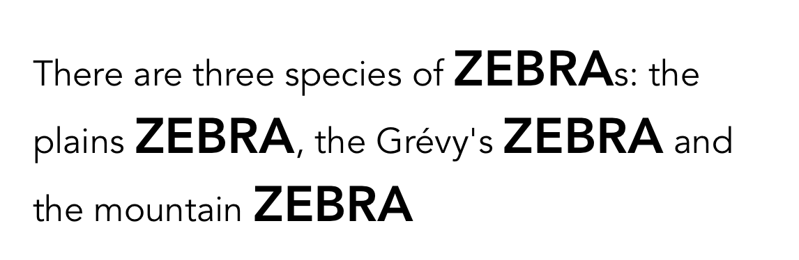
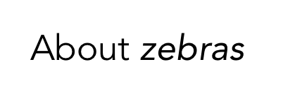
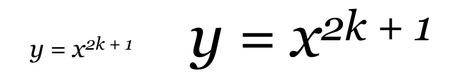
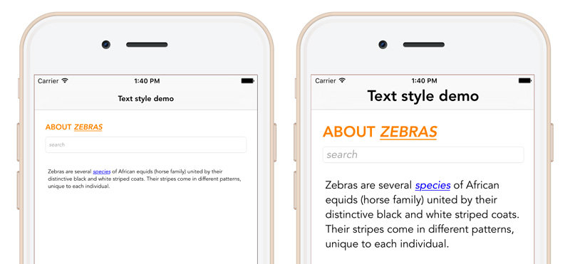

HandyText
--------------

Purpose
--------------
HandyText is a helper library that allows to create and manage text styles in a clear declarative manner.

Problem solved
--------------

Work on UI tasks is full of repetition when it goes about defining text appearance. You have to refer to mockups all the time, or to search and copy elements of same appearance. Both ways leave many ways for errors, and both make late changes in design quite painful. Amount of work for changing a font in typical elements is proportional to project's size.
The alternative way is in avoiding the use of IB for defining text appearance, but handling it in code. 


Supported OS & SDK Versions
-----------------------------

Swift 5.0
* Supported build target - iOS 10.1 and up (Xcode 10)

Installation
--------------

```ruby
# In your Podfile

pod 'HandyText'
```

Declare own text styles as static functions or properties of TextStyle class.

Version 1.4.5

- Release version.

Usage
--------------

First, let's define some text styles:

```swift
extension TextStyle {
  static var plainText: TextStyle {
    return TextStyle(font: .avenir)
  }
}
```

The Font is only required parameter for creating a brand new style, all other params are set to defaults. Instead of copying instances and modifying properties the library proposes more declarative 'cascade' style. Think you need a style for headers based on plain text:

```swift
  static var header1: TextStyle {
    return plainText.withSizeMultiplied(by: 1.4).uppercase().bold()
  }
```

It's remarkable that styles are chained, in other words based on each other. Changing basic style font to .georgia makes all style scheme look different, but still well fitted.

Attributed strings
----------------

The costs of using text styles is switching to attributed text, which is supported by the most of UIKit classes.
```swift
label.attributedText = "Hello, World!".withStyle(.plainText)
```
 

### Merging attributed strings
Attributed strings can be combined to achieve more complex appearance:
```swift
let title = "First name: ".withStyle(.placeholder)
let name = "Michael".withStyle(.plainText)
label.attributedText = title + name
 ```
 

### Highlighting words
You can highlight specific substrings with a different text style:
```swift
let text = "There are three species of zebras: the plains zebra, the Grévy's zebra and the mountain zebra"
label.attributedText = text.withStyle(.plainText).applyStyle(.header1, toOccurencesOf: "zebra")
```
 


For displaying strings with tags you define a tag scheme:
```swift
    let scheme = TagScheme()
    scheme.forTag("b") { $0.bold() }
    scheme.forTag("i") { $0.italic() }
```
In the scheme for each custom tag you register a block defining the modification of the initial text style.
Nested tags are supported. Text marked as following ```"<i><b>lions</b></i>"``` will be bold italic.
To convert a string into an attributed string:
```swift
let result = "about <i>zebras</i>".withStyle(.plainText, tagScheme: scheme)
```
 


FAQ
--------------
### How many styles do I need? 
As little as possible. Average application has 2-3 basic and several complementary text styles. It's not necessary to create a new style if it differs with only the color or alignment. Better to extend the style at place. 

### Absolute or relative size?
You are used to define text size in points: 10 for plain text, 15 for heading and so on. But let's look from another angle: what this numbers mean? I guess, the designer could think something like 'let headers be a half times more than normal text'. Due to method ```withSizeMultiplied(by:)``` you can define text sizes proportionally. In this case, when the base style changes its size, the whole text scheme scales proportionally. Baseline offset can also be defined relative, which will keep proportions in custom superscripts like below:



### What can make the text size change?
Here are some ideas. By using Dynamic Text Size in the base style, you will make your app sensitive to the Accessibility preferences of the device. For large devices it's reasonable to use slightly larger fonts. Some apps allow users to change appearance themes. With HandyText updating fonts becomes a simple task.



### Too many outlets!
To use HandyText effectively you must create an outlet for every text containing view. Is it that bad? In well-designed projects all strings are kept in the single file: Localizable.strings. Not in storyboards, not in the code. With this approach the whole app can be translated into a new language without changing a line of code. HandyText lib encourages you to use this approach: fetch a localized string, apply a style, display the result in the corresponding outlet.

### How to add links to my attributed text?
The library doesn't add any new abilities to UIKit classes. For assigning a link to a chunk of text it uses NSLinkAttributeName. For more info refer to the [official docs](https://developer.apple.com/reference/uikit/uitextviewdelegate/1649337-textview).

### How do I call my text styles?
Avoid giving names based on specific usage, try to keep it more generic. For instance, 'screenHeading' is a good name, 'orangeHeaderInFriendsList' – is not.

### Can HandyText help me improve my design specs?
Of course. As a developer, together with design team you can define a table of common text styles and rules for describing modifiers. Instead of "HelveticaNeue-Bold, 15 pt, color: FF0000" it can be "style: header, color: tomatoRed".


License
----------------

    The MIT License (MIT)

    Copyright © 2016 Aleksey Chernish

    Permission is hereby granted free of charge to any person obtaining a copy of this software and associated documentation files (the "Software") to deal in the Software without restriction, including without limitation the rights to use, copy, modify, merge, publish, distribute, sublicense, and/or sell copies of the Software, and to permit persons to whom the Software is furnished to do so, subject to the following conditions:

    The above copyright notice and this permission notice shall be included in all copies or substantial portions of the Software.

    THE SOFTWARE IS PROVIDED "AS IS", WITHOUT WARRANTY OF ANY KIND, EXPRESS OR IMPLIED, INCLUDING BUT NOT LIMITED TO THE WARRANTIES OF MERCHANTABILITY,
    FITNESS FOR A PARTICULAR PURPOSE AND NONINFRINGEMENT. IN NO EVENT SHALL THE
    AUTHORS OR COPYRIGHT HOLDERS BE LIABLE FOR ANY CLAIM, DAMAGES OR OTHER
    LIABILITY, WHETHER IN AN ACTION OF CONTRACT, TORT OR OTHERWISE, ARISING FROM,
    OUT OF OR IN CONNECTION WITH THE SOFTWARE OR THE USE OR OTHER DEALINGS IN
    THE SOFTWARE.

